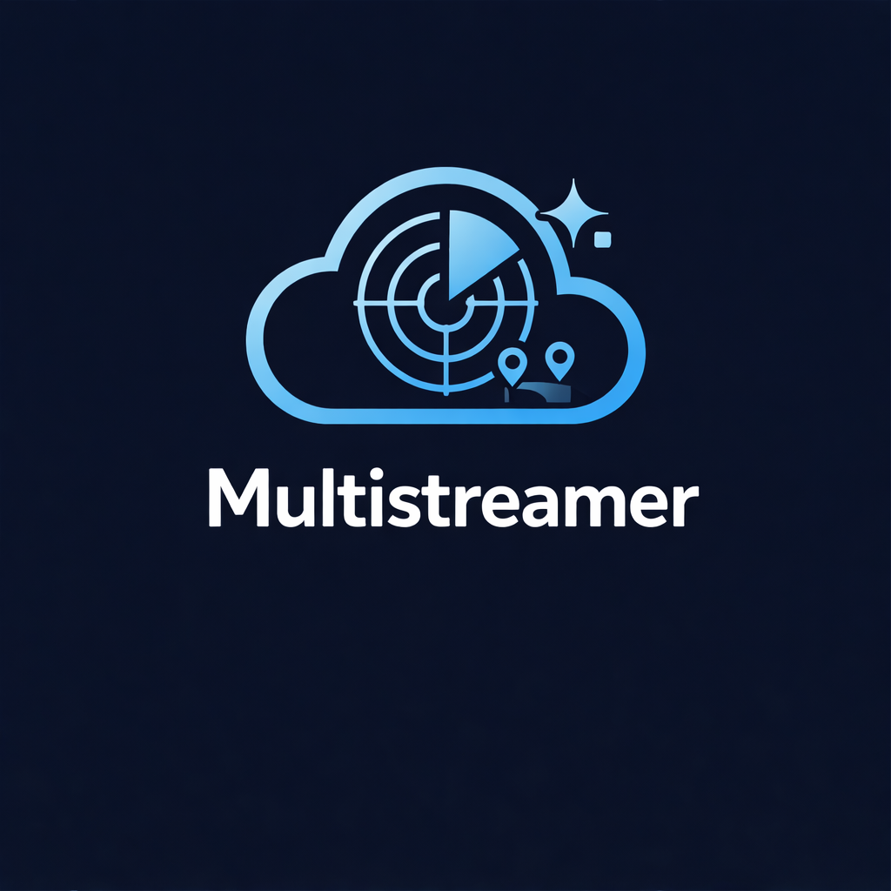

<!-- codex-branding:start -->
<p align="center"></p>

<p align="center">
  
  
  
</p>
<!-- codex-branding:end -->

# MultiStream

A self-hosted, real-time multi-video streaming viewer with chat, perfect for watch parties, storm tracking, event monitoring, and more.

  


# Create your own room here:
https://sysadmindoc.github.io/Multistreamer/


## Features

- **Multi-Video Grid** - Watch multiple YouTube streams in a responsive Brady Bunch-style grid
- **Featured Layout** - Highlight one main video with smaller sidebar streams
- **Real-Time Sync** - All viewers see the same streams, layout, and settings instantly
- **Live Chat** - Built-in chat room synced across all viewers
- **Host Controls** - Only hosts can add/remove streams; viewers just watch
- **No Backend Required** - Uses Gun.js for P2P sync, works on static hosting (GitHub Pages)
- **Room Creator** - Create unlimited rooms without editing any files
- **Customizable** - Themes, colors, labels, announcements, and more

## Quick Start

### Deploy to GitHub Pages

1. **Fork or clone this repository**

2. **Enable GitHub Pages**
   - Go to repository Settings → Pages
   - Source: Deploy from a branch
   - Branch: `main` (or `master`), folder: `/ (root)`
   - Save

3. **Access your site**
   - Your URL will be: `https://yourusername.github.io/repository-name/`

### Create Your First Room

1. Visit your deployed site (no URL parameters)
2. Fill in:
   - **Room name**: `my-watch-party` (URL-friendly, lowercase)
   - **Room title**: `My Awesome Watch Party!` (displayed to viewers)
   - **Host password**: Your secret key (auto-generated if left blank)
3. Click **Create Room**
4. Copy your **Host Link** (keep private!) and **Viewer Link** (share publicly!)

## Usage

### As a Host

Access your room with the host link:
```
https://yoursite.github.io/?room=my-room&host=yourSecretPassword
```

**Controls available:**
| Control | Description |
|---------|-------------|
| Add Stream | Paste YouTube URL and click Add |
| Set Main | Make a video the featured/large video |
| Label | Give streams custom names |
| Mute/Unmute All | Control audio for all streams |
| Weather | Add a Windy.com radar panel |
| Settings | Customize theme, colors, layout |
| Share | Get viewer/host links |
| Clear | Remove all streams |

**Room Management:**
- Click the room title to edit it (syncs to all viewers)
- Set an announcement message in Settings
- Export your config to save/reuse setups

### As a Viewer

Access with the viewer link:
```
https://yoursite.github.io/?room=my-room
```

Viewers can:
- Watch all streams the host has added
- Mute/unmute individual videos locally
- Participate in chat
- See real-time updates when host makes changes

Viewers cannot:
- Add or remove streams
- Change layout or settings
- Edit room title or announcements

## URL Parameters

| Parameter | Description | Example |
|-----------|-------------|---------|
| `room` | Room identifier (required for viewing) | `room=blizzard-2025` |
| `host` | Host password (enables host controls) | `host=mySecretKey` |

**Examples:**
```
# Room creator (no params)
https://yoursite.github.io/

# Viewer mode
https://yoursite.github.io/?room=storm-watch

# Host mode
https://yoursite.github.io/?room=storm-watch&host=abc123
```

## Features in Detail

### Layouts

- **Grid** - Equal-sized tiles, auto-arranges based on stream count
- **Featured** - One large main video + sidebar with remaining streams

### Synced Settings

All these sync in real-time to viewers:
- Room title & announcement
- Streams (add/remove/order)
- Mute states
- Layout mode & featured video
- Custom stream labels
- Theme & accent color
- Grid gap & label visibility
- Weather panel & location

### Chat

- Usernames saved locally
- Messages sync in real-time
- Host messages highlighted with badge
- 2-hour message history
- Collapsible bottom bar (doesn't cover videos)

### Weather Panel

- Powered by Windy.com embeds
- Shows radar/precipitation overlay
- Configurable lat/lon coordinates
- Great for storm tracking!

### Themes

- **Dark** - Default dark theme
- **Midnight** - Deep blue tones
- **AMOLED** - Pure black for OLED screens

### Import/Export

Save your room configuration as JSON:
```json
{
  "version": 3,
  "room": "my-room",
  "streams": [
    { "id": "dQw4w9WgXcQ", "muted": true, "label": "Main Camera" },
    { "id": "abc123xyz", "muted": true, "label": "Backup" }
  ],
  "settings": {
    "layout": "featured",
    "featuredId": "dQw4w9WgXcQ",
    "weather": { "enabled": true, "lat": 40.7128, "lon": -74.006 },
    "display": { "gridGap": 2, "labels": "hover", "theme": "dark", "accent": "#00d4ff" }
  }
}
```

Import configs to quickly set up similar events.

## Technical Details

### How It Works

MultiStream uses [Gun.js](https://gun.eco/) for decentralized, real-time data sync:
- No server/database required
- Data syncs via public relay servers
- Works on any static hosting (GitHub Pages, Netlify, etc.)
- Room state persists even when host disconnects

### Browser Support

- Chrome/Edge (recommended)
- Firefox
- Safari
- Mobile browsers

### Dependencies

- [Gun.js](https://gun.eco/) - Decentralized database (loaded via CDN)
- [Windy.com](https://windy.com/) - Weather radar embeds

### Privacy

- No data stored on your server
- Room data stored on Gun.js relay network
- Chat messages expire after 2 hours
- No analytics or tracking

## Self-Hosting Gun Relay (Optional)

For better reliability, you can run your own Gun relay:

```bash
npm install gun
npx gun
```

Then update the Gun initialization in the HTML:
```javascript
const gun = Gun(['https://your-relay-server.com/gun']);
```

## Use Cases

- **Storm/Weather Tracking** - Multiple news streams + radar
- **Sports Watch Parties** - Multiple game angles or broadcasts  
- **Security Monitoring** - Multiple camera feeds
- **Event Coverage** - News streams during breaking events
- **Gaming** - Multiple Twitch/YouTube gaming streams
- **Conference Rooms** - Display multiple video sources

## Contributing

Contributions welcome! Feel free to:
- Report bugs
- Suggest features
- Submit pull requests

## License

MIT License - feel free to use, modify, and distribute.

## Acknowledgments

- [Gun.js](https://gun.eco/) for the amazing decentralized sync
- [Windy.com](https://windy.com/) for embeddable weather maps
- Inspired by the need to watch multiple blizzard streams at once!

---

**Made for storm chasers, sports fans, and anyone who needs to watch ALL the streams.**
