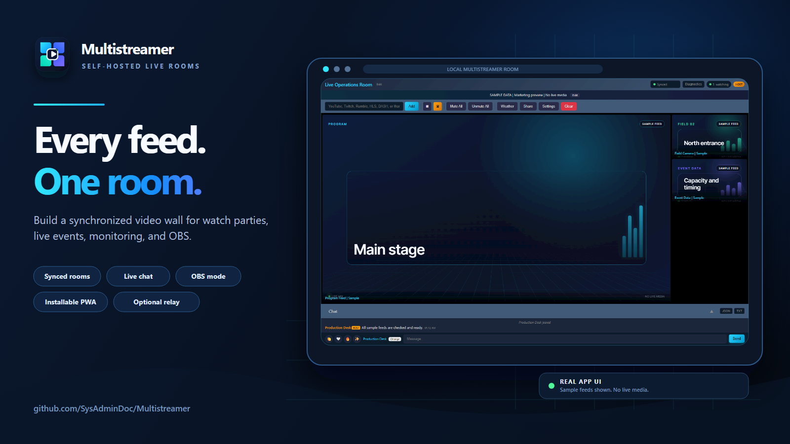
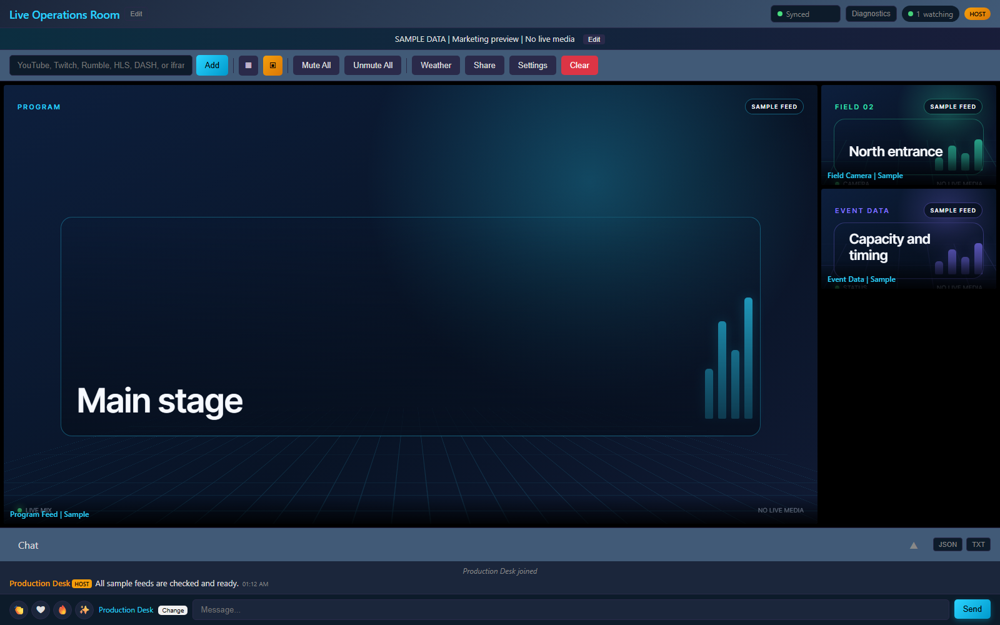
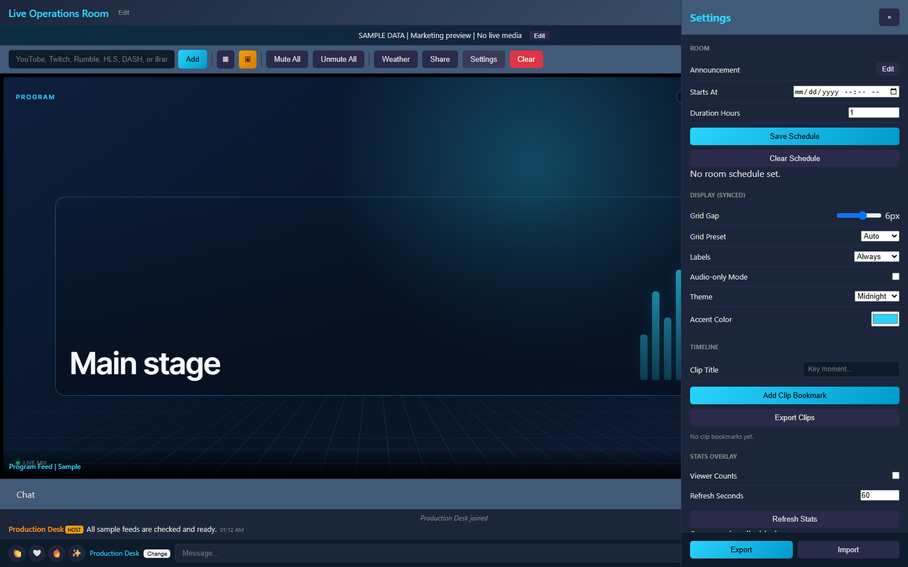
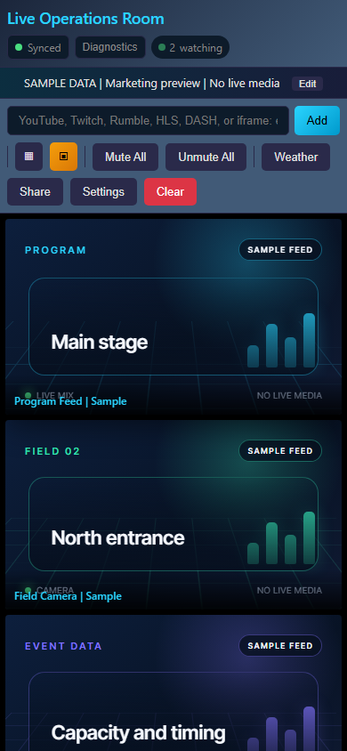

# Multistreamer

[](https://github.com/SysAdminDoc/Multistreamer/releases/tag/v0.38.1) [](LICENSE) [](manifest.webmanifest) [](#development)

Put multiple live feeds in one room, set the layout once, and keep every viewer in sync. Multistreamer works as a watch-party hub, an event desk, a monitoring wall, or a clean OBS browser source.

[Open the live app](https://sysadmindoc.github.io/Multistreamer/) | [Download the latest release](https://github.com/SysAdminDoc/Multistreamer/releases/latest) | [Report a problem](https://github.com/SysAdminDoc/Multistreamer/issues)

<p align="center">
  <a href="https://ko-fi.com/X8K126YVER">
    
  </a>
</p>

<p align="center">
  <sub><em>If this project helps you, a coffee helps me keep working on it.</em></sub>
</p>

## See it in action

The images below were captured from the real app in a local test room. The video surfaces contain clearly labelled sample feeds, not live third-party media.



<details>
<summary>View settings and mobile screenshots</summary>

### Synced room settings



### Mobile featured layout



</details>

## What it does

- Runs from static hosting as an installable PWA. Use the public Gun relay or point the app at your own relay.
- Plays YouTube, Twitch, Rumble, HLS, DASH, and approved iframe sources in grid or featured layouts.
- Synchronizes streams, labels, volume, room schedules, display settings, and announcements for everyone in the room.
- Gives hosts live chat controls, reactions, clip bookmarks, diagnostics, and moderation tools.
- Supplies a clean `?obs=1` view for OBS browser sources without the room controls or chat chrome.
- Supports weather panels, NWS alert banners, stream map markers, and public viewer-count badges when a monitoring room needs them.

## Start a room

1. Open the [hosted app](https://sysadmindoc.github.io/Multistreamer/).
2. Enter a short room name and a display title. Add a host password or let the app generate one.
3. Keep the host link private. Send the viewer link to everyone watching.
4. Paste stream URLs into the Add field, then choose a grid or featured layout.

The host password is removed from the visible URL after the first successful login. Only its SHA-256 hash is written to room metadata. The plaintext password stays in that host browser's local storage.

## Provider support

| Source | Accepted input | Notes |
| --- | --- | --- |
| YouTube | Video URL, Shorts URL, embed URL, or video ID | Embedded playback and optional LiveChat mirror |
| Twitch | Channel or VOD URL | Channel rooms include the Twitch chat sidecar |
| Rumble | Direct embed URL | Uses the Rumble embed player |
| HLS | Direct `.m3u8` URL | Native playback on Safari, hls.js elsewhere |
| DASH | Direct `.mpd` URL | Uses the bundled dash.js player |
| Iframe | `iframe:https://...` | The host must be on the allowlist in `stream-sources.js` |

RTSP does not play directly in a normal browser. Convert it to HLS or DASH with a trusted gateway first.

## Self-host it

Multistreamer is a static site. A basic deployment only needs the files in this repository.

### GitHub Pages

1. Fork or clone the repository.
2. Open the repository's **Settings**, then **Pages**.
3. Choose **Deploy from a branch** and publish the root of `main`.
4. Open `https://YOUR-NAME.github.io/Multistreamer/`.

### Local preview

```powershell
python -m http.server 4173 --bind 127.0.0.1
```

Then open `http://127.0.0.1:4173/`.

### Optional private relay

The included relay package keeps room synchronization on infrastructure you control.

```powershell
cd relay
docker compose up -d --build
```

The local relay endpoint is `http://localhost:8765/gun`.

Set `window.MULTISTREAMER_RELAYS` before the app script runs:

```html
<script>
window.MULTISTREAMER_RELAYS = ['https://rooms.example.com/gun'];
</script>
```

The relay container stores Gun data in its configured volume. Put it behind HTTPS before sharing rooms outside your network.

## Useful room links

```text
# Viewer
https://example.com/?room=launch-room

# First host login
https://example.com/?room=launch-room&host=private-password

# OBS browser source
https://example.com/?room=launch-room&obs=1

# Shared clip bookmark
https://example.com/?room=launch-room&clip=clip-id
```

| Parameter | Purpose |
| --- | --- |
| `room` | Selects the synchronized room |
| `host` | Supplies the first-use host password, then disappears from the address bar |
| `obs=1` | Hides controls and chat for a full-viewport OBS source |
| `clip` | Opens a shared timeline bookmark |

## Room controls

Hosts can add or remove feeds, pick the featured stream, rename tiles, change the grid, mix stream volume, and create share links. Settings also include:

- Room schedules and announcements
- Grid presets, label behavior, themes, and audio-only mode
- Timeline bookmarks with JSON export
- Optional public viewer counts for supported providers
- Weather overlays and active NWS alert lookup
- Supabase or Firebase snapshot mirroring with credentials stored only in the host browser
- Chat slow mode, rate limits, export, kick, and ban controls

Viewers receive the synchronized room state and can manage local playback, use chat, or send reactions. When the original host disconnects, active viewers elect a temporary host until the real host returns.

## Privacy and reliability

- Host secrets are hashed before room metadata is written. Diagnostics redact the `host` query parameter.
- Room snapshots are cached locally for reconnects. The service worker also caches the installable app shell.
- HLS and DASH streams support live-buffer correction, synchronized scrubs, and per-feed latency offsets.
- Public relays are convenient, but they are shared infrastructure. Use the included relay when you need operational control or predictable retention.
- YouTube API keys and optional persistence credentials remain in the host browser. They are not synchronized to viewers.

## Development

Requires Node.js 20 or newer and a Playwright Chromium installation.

```powershell
npm ci
npx playwright install chromium
npm test
```

The test suite covers URL parsing, provider embeds, PWA wiring, import validation, privacy behavior, room synchronization, desktop workflows, and the mobile featured layout. The rendered suite starts a private local Gun relay and never uses the active desktop.

To recapture the checked-in sample screenshots:

```powershell
node scripts/capture-marketing.mjs
```

## Project files

| Path | Purpose |
| --- | --- |
| `index.html` | Complete room creator and viewer interface |
| `stream-sources.js` | Source parsing, normalization, and embed policy |
| `manifest.webmanifest` and `sw.js` | Installable PWA shell and offline cache |
| `vendor/` | Pinned Gun, hls.js, and dash.js browser runtimes |
| `relay/` | Optional Dockerized Gun relay |
| `assets/brand/` | Production vector identity and wordmark |
| `assets/concepts/` | Archived logo directions, originals, and marketing working files |
| `tests/` | Static checks and rendered browser coverage |

## License

[MIT](LICENSE)
